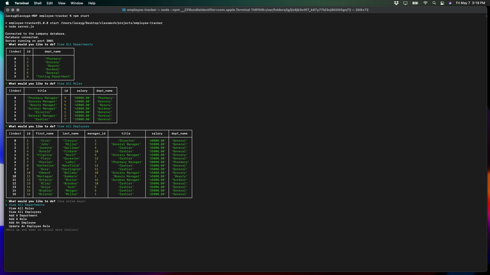

# Employee Tracker

# Description
A command line application that accepts user input about the company to assist in tracking employees information within the company including an employee's role, salary, manager and department.

# Table Of Contents
* [Installation](#installation)
* [Usage](#usage)
* [License](#license)
* [Contributions](#contributions)
* [Questions](#questions)

# Installation
Verify that you have your MYSQL database set up and then clone the repository to your local machine and open your terminal. Go to the root of the cloned directory and run 'npm i inquirer express' in the command line. In the connection.js file, enter your username and password to your MYSQL database and save.

# Usage
To use the application, follow install instructions and then in the root of the directory run 'npm start' in the command line. As you select different options, you will see the mock data displayed. There are options to delete this data as well as options to add your own.
Click [here](https://drive.google.com/file/d/1-isFEsDepEsJq1vufs4VVz_FWCBZUbZC/view) to watch the walkthrough video.

# Licensing
This project is covered under the following licenses:
MIT

# Contributing
This project was created by lacey-griffith.

# Questions
If you have any questions please contact me at lacey.griffith04@gmail.com.
You can also visit my GitHub profile by clicking [here](https://github.com/lacey-griffith) and the repository for this project can be found [here](https://github.com/lacey-griffith/employee-tracker).

# Site Image
Here is a screen shot of an example of data being displayed.
